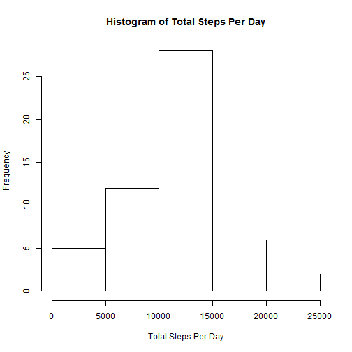
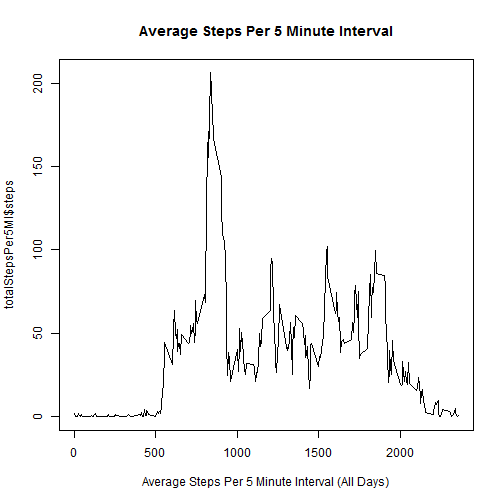
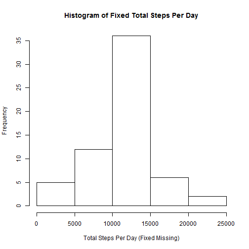
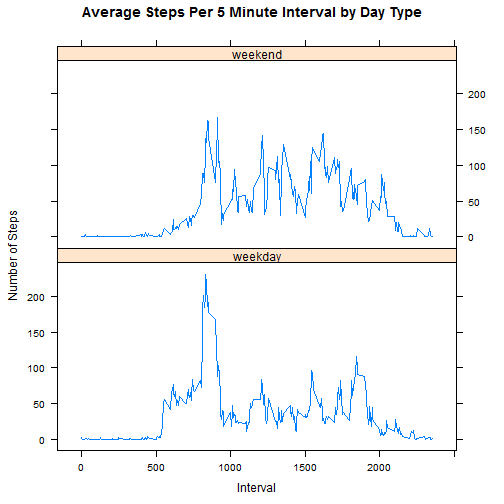

 
=========================================================================  

###Set Working Directory for this Project

```r
setwd("~/DataScientistClasses/ReproAnalysis/proj1/gitproj1/RepData_PeerAssessment1")
```

###Loading and preprocessing the data
Get data file from the web, unzip it, and read it into a data frame

```r
fileURL <- "http://d396qusza40orc.cloudfront.net/repdata%2Fdata%2Factivity.zip"
download.file(fileURL,dest="activity.zip", mode="wb")
unzip("activity.zip")
steps1<-read.csv("activity.csv", stringsAsFactors = FALSE)
```

Mark the observations with missing step values

```r
missing<-is.na(steps1$steps)
```

###What is mean number of total steps taken per day?
####For this part of the assignment, you can ignore the missing values in the dataset.

Make a histogram of the total number of steps taken each day

```r
totalStepsPerDay<-aggregate(steps~date,data=steps1[!missing,],"sum")
hist(totalStepsPerDay$steps,main="Histogram of Total Steps Per Day",xlab="Total Steps Per Day")
```

 

Calculate and report the mean and median total number of steps taken per day

```r
TSPD.mean<-as.integer(mean(totalStepsPerDay$steps))
TSPD.med<-median(totalStepsPerDay$steps)
```
The average total number of steps per day is 10766 and meadian is 10765   

###What is the average daily activity pattern?

####Make a time series plot (i.e. type = "l") of the 5-minute interval (x-axis) and the average number of steps taken, averaged across all days (y-axis)
Here is a tiime series plot of the total number of steps per day

```r
totalStepsPer5MI<-aggregate(steps~interval,data=steps1[!missing,],"mean")
plot(totalStepsPer5MI$interval,totalStepsPer5MI$steps,
     main="Average Steps Per 5 Minute Interval",
     xlab="Average Steps Per 5 Minute Interval (All Days)",type = "l")
```

 

```r
most.steps<-totalStepsPer5MI[totalStepsPer5MI$steps==max(totalStepsPer5MI$steps),]$interval
```
The most steps taken on average across all the days occurs at time interval 835.
  
###Imputing missing values
####Calculate and report the total number of missing values in the dataset (i.e. the total number of rows with NAs)

```r
missingSteps<-is.na(steps1$steps)
missingDate<-is.na(steps1$date)
missingInterval<-is.na(steps1$interval)
MissSteps<-sum(missingSteps)
MissDate<-sum(missingDate)
MissInterval<-sum(missingInterval)
```
There are 2304 missing values in the steps field.  
There are 0 missing values in the date field.  
There are 0 missing values in the interval field. 

####Devise a strategy for filling in all of the missing values in the dataset. The strategy does not need to be sophisticated. For example, you could use the mean/median for that day, or the mean for that 5-minute interval, etc.
Fill missing steps with the average of the steps from that 5-minute interval across the rest of the days.

```r
totalStepsPer5MI<-aggregate(steps~interval,data=steps1[!missing,],"mean")

steps2<-cbind(steps1,rep(totalStepsPer5MI[,2],61))
    
fix.steps<-function(x){
    newstep<-list()
    for (i in 1:nrow(x)){
    newstep[[i]]<-ifelse(is.na(x[i,1]),x[i,4],x[i,1])
    }
    return(newstep)
}
```

####Create a new dataset that is equal to the original dataset but with the missing data filled in.

```r
fixsteps<-fix.steps(steps2)

steps3<-cbind(unlist(fixsteps),steps2[,2:3])
names(steps3)[1]<-"steps"
```

####Make a histogram of the total number of steps taken each day and Calculate and report the mean and median total number of steps taken per day. Do these values differ from the estimates from the first part of the assignment? What is the impact of imputing missing data on the estimates of the total daily number of steps?


```r
totalStepsPerDay2<-aggregate(steps~date,data=steps3,"sum")
hist(totalStepsPerDay2$steps,main="Histogram of Fixed Total Steps Per Day",xlab="Total Steps Per Day (Fixed Missing)")
```

 

Here is the mean and median of the fixed total number of steps per day

```r
TSPD2.mean<-as.integer(mean(totalStepsPerDay2$steps))
TSPD2.med<-as.integer(median(totalStepsPerDay2$steps))
```
The average total number of steps per day is 10766 and meadian is 10766 after fixing the missing steps.  

Before fixing, the average total steps per day was 10766 and meadian is 10765
  
The average and median did not change before and after the fix.  Full days were missing steps and those days were replaced by the average steps from the non-missing days.    

Therefore, there was no impact by imputing the missing value.  

###Are there differences in activity patterns between weekdays and weekends?
####Create a new factor variable in the dataset with two levels - "weekday" and "weekend" indicating whether a given date is a weekday or weekend day.


```r
daylist<-c("Mon","Tue","Wed","Thu","Fri")
steps3$weekday<-as.factor(sapply(steps3[,2],function(x){    
    ifelse(weekdays(as.Date(x,"%Y-%m-%d"),abbreviate = TRUE) %in% daylist,"weekday","weekend" )
}))
```

####Make a panel plot containing a time series plot (i.e. type = "l") of the 5-minute interval (x-axis) and the average number of steps taken, averaged across all weekday days or weekend days (y-axis).


```r
totalStepsPer5MIb<-aggregate(steps~interval+weekday,data=steps3,"mean")
library(lattice)
xyplot(steps~interval|weekday,data=totalStepsPer5MIb,
     main="Average Steps Per 5 Minute Interval by Day Type", layout = c(1, 2),
     xlab="Interval",ylab="Number of Steps",
     type = "l")
```

 

